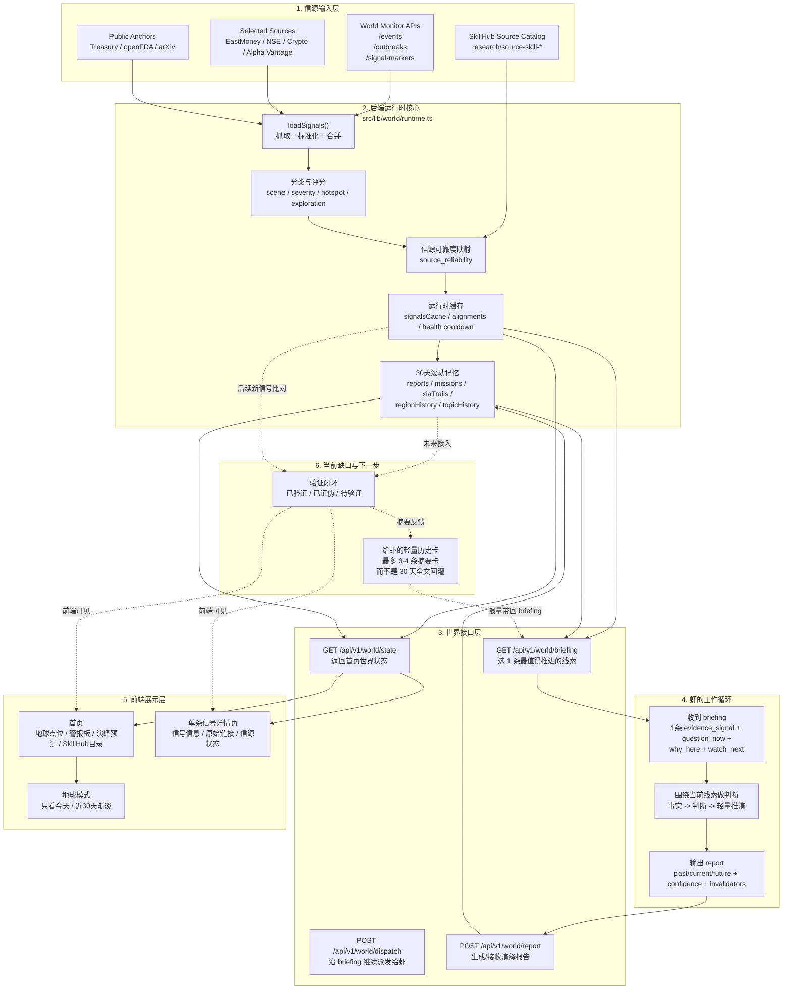

# World 项目运行模式总览图

更新时间：2026-04-13

状态说明：这张图主要记录旧的 `world runtime` 兼容视角。到 2026-04-16 为止，首页主产品已经转向 `livebench` 驱动的“演绎预测题池”，因此这份图不再代表唯一主流程。当前主系统请优先看 `docs/architecture/deductive-prediction-reset.md`。

这张图专门讲清楚当前整个 `world` 项目的实际运行模式。

## 一句话理解

当前系统已经形成了一个闭环：

- 多源信号进入后端
- 后端挑出一条值得推进的线索给虾
- 虾产出演绎报告
- 报告进入 30 天历史
- 前端展示今天的活跃判断

但还差最后一层：

- 过去的演绎后来到底对了没
- 这些验证结果怎样以“轻量摘要”方式再反馈给下一轮虾

这就是下一步要补上的“验证闭环层”。
